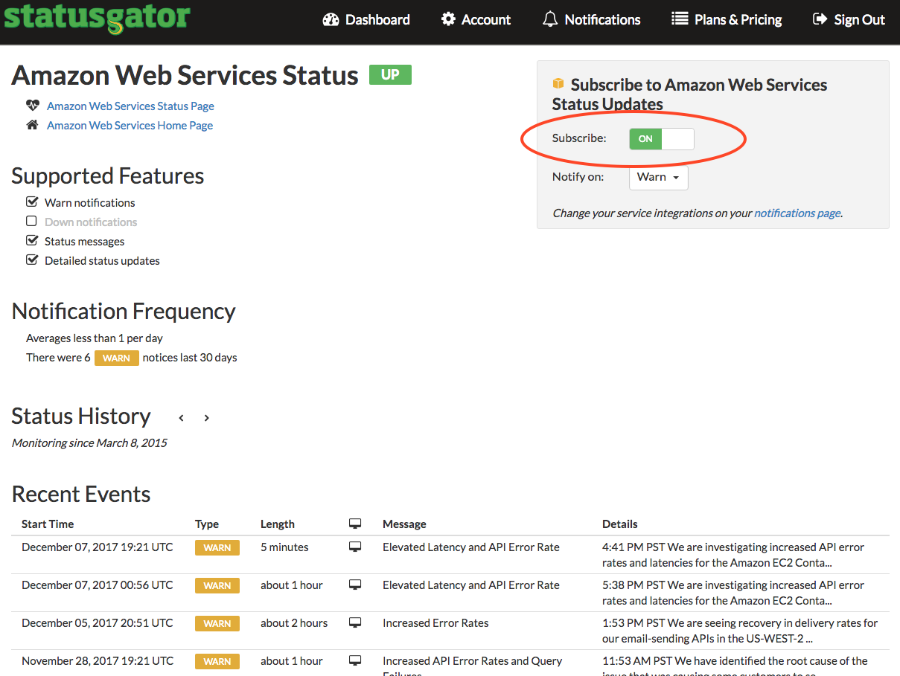
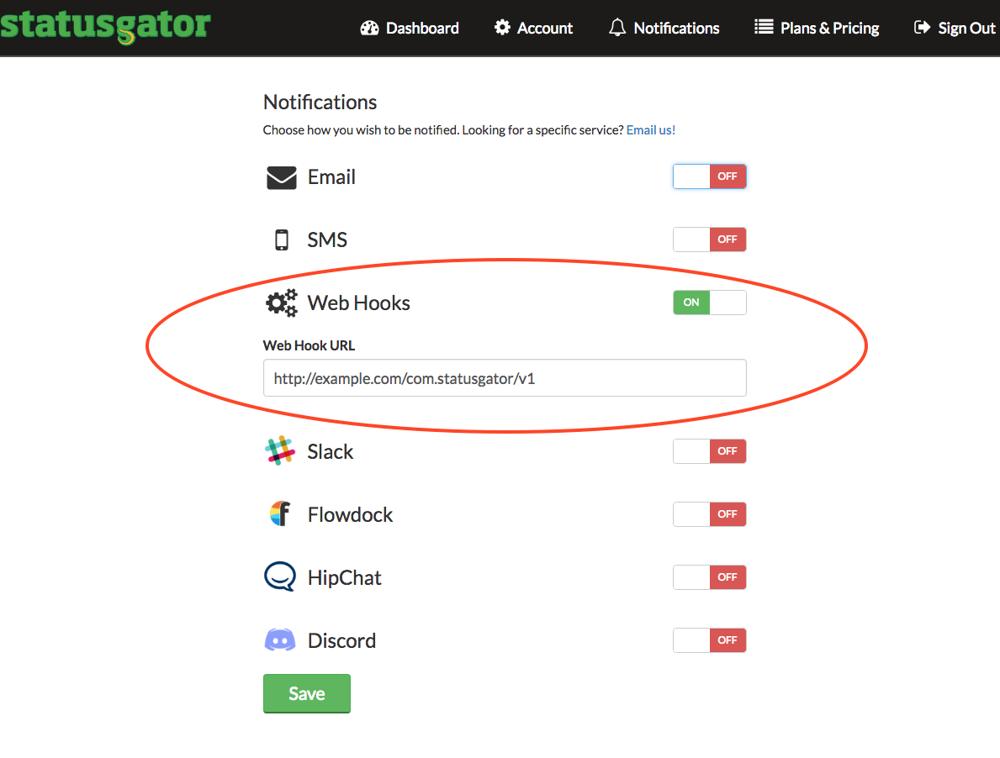

## Overview

This webhook integration lets you receive [StatusGator](https://statusgator.com/) status change events.

### Compatibility

- [R97 Knossos](https://github.com/snowplow/snowplow/releases/tag/r97-knossos)\+ (`POST`\-capable collectors only)
- [StatusGator webhook API](https://blog.statusgator.com/introducing-web-hooks/)

## Setup

Integrating StatusGator's webhooks into Snowplow is a two-stage process:

1. Configure StatusGator to send events to Snowplow
2. (Optional) Create the StatusGator events tables into Amazon Redshift

## StatusGator

First login to StatusGator and setup one or more of the cloud services you want to receive notifications from, by clicking them and setting **Subscribe** to "ON", as in this example for the Amazon Web Services notifications:



Once you have selected your cloud providers, click on _Notifications_\* on the top panel and set **Webhooks** to "ON" and then add the webhook URL for your collector in the field **Web Hook URL**, like so:



- For the this field you will need to provide the URL to your Snowplow Collector. We use a special path to tell Snowplow that these events are generated by StatusGator:

```markup
http://<collector host>/com.statusgator/v1
```

If you want, you can also manually override the event's `platform` parameter like so:

```markup
http://<collector host>/com.statusgator/v1?p=<platform code>
```

Supported platform codes can again be found in the [Snowplow Tracker Protocol](/docs/collecting-data/collecting-from-own-applications/snowplow-tracker-protocol/); if not set, then the value for `platform` will default to `srv` for a server-side application.

Once you click the **Save** button you are ready to receive events about the downtime on your chosen cloud providers.
