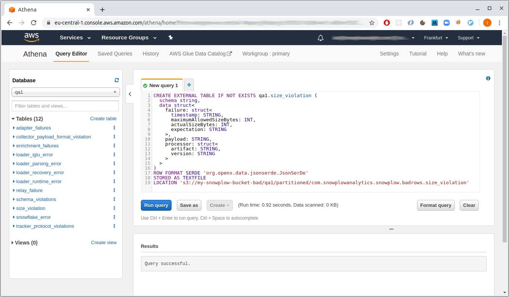
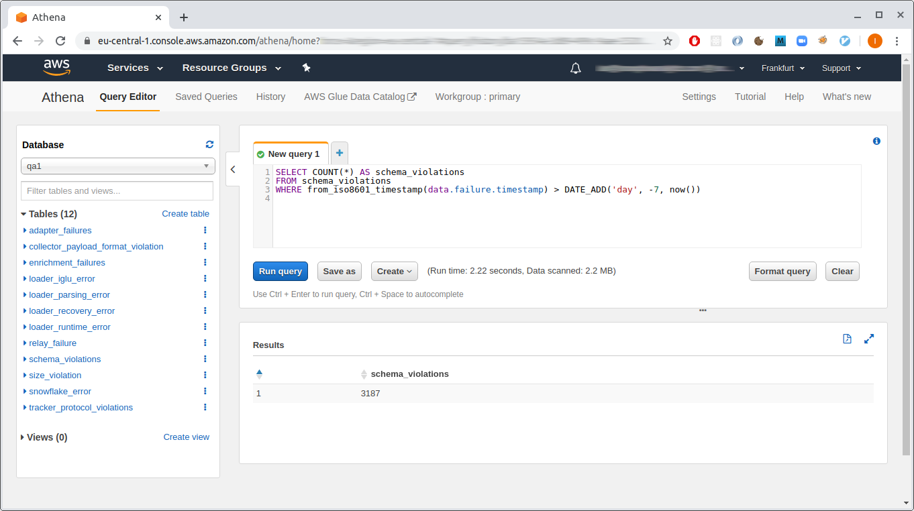
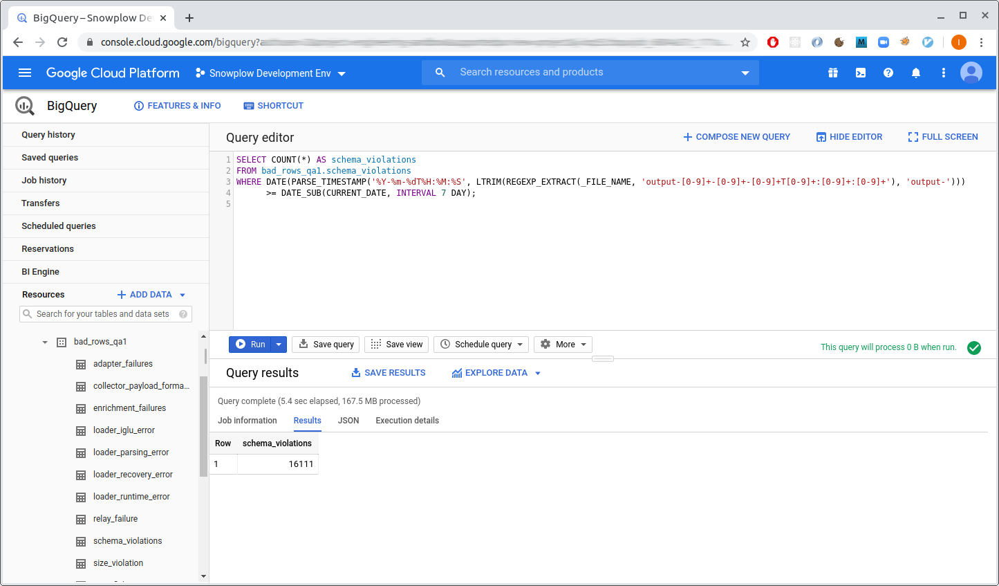

[Athena](https://aws.amazon.com/athena/) on AWS and [BigQuery](https://cloud.google.com/bigquery) on GCP are tools that let you query your failed events, using the cloud storage files as a back-end data source.

```
SELECT data.failure.messages FROM adapter_failures
WHERE from_iso8601_timestamp(data.failure.timestamp) > timestamp '2020-04-01'
```

This is great for debugging your pipeline without the need to load your failed events into a separate database.

The [snowplow-badrows-tables repo](https://github.com/snowplow-incubator/snowplow-badrows-tables) contains resources and instructions to set up Athena/BigQuery for your pipeline. To create tables, you need to provide a table definition corresponding to the JSON schema for each of your failed event files. Each different failed event type (e.g. schema violations, adapter failures) has its own JSON schema, and therefore requires its own separate table.

## Athena instructions

Go to [the Athena dashboard](https://eu-central-1.console.aws.amazon.com/athena/home) and use the query editor. Start by creating a database named after your pipeline (e.g. prod1 or qa1):

```
CREATE DATABASE IF NOT EXISTS {{ DATABASE }}
```

Then run each sql statement provided in the [badrows-tables repo](https://github.com/snowplow-incubator/snowplow-badrows-tables/tree/master/athena) by copying them into the Athena query editor:

- 
    

Create table in Athena

As example of using your Athena tables, you might start by getting counts of each failed event type from the last week. Repeat this query for each table you have created:

```
SELECT COUNT(*) FROM schema_violations
WHERE from_iso8601_timestamp(data.failure.timestamp) > DATE_ADD('day', -7, now())
```

- 
    

Athena query

If you have schema violations, you might want to find which tracker sent the event:

```
SELECT data.payload.enriched.app_id, COUNT(*) FROM schema_violations
WHERE from_iso8601_timestamp(data.failure.timestamp) > DATE_ADD('day', -7, now())
GROUP BY data.payload.enriched.app_id
```

You can do a deeper dive into the error messages to get a explanation of the last 10 failures:

```
SELECT data.failure.messages[1].field AS field,
       data.failure.messages[1].value AS value,
       data.failure.messages[1].error AS error,
       data.failure.messages[1].json AS json,
       data.failure.messages[1].schemaKey AS schemaKey,
       data.failure.messages[1].schemaCriterion AS schemaCriterion
FROM schema_violations
ORDER BY data.failure.timestamp DESC
LIMIT 10
```

## BigQuery instructions

These instructions make use of the [bq command-line tool](https://cloud.google.com/bigquery/docs/bq-command-line-tool) which is packaged with the [google cloud sdk](https://cloud.google.com/sdk/docs). Follow the sdk instructions for how to [initialize and authenticate the sdk](https://cloud.google.com/sdk/docs/initializing). Also take a look at the [BigQuery dashboard](https://console.cloud.google.com/bigquery) as you run these commands, so you can see your tables as you create them.

##### Missing fields ⚠️

_The following fields are missing from the bigquery table definitions:_

- _Enrichment failures: `data.failure.message.error`_
- _Loader iglu error: `data.failure.dataReports.targets`_
- _Loader recovery error: `data.failure.error.location`_
- _Schema violations: `data.failure.messages.error`_
- _Tracker protocol violations: `data.failure.messages.error`_

_We have omitted fields from the table definitions if they are "polymorphic", e.g. where they can be a string or an object depending on the context. Unfortunately this makes the fields inaccessible in BigQuery. This problem will be fixed in future versions of Snowplow, by removing polymorphic fields (see issues in [snowplow-badrows](https://github.com/snowplow-incubator/snowplow-badrows/issues/50) and [iglu-central](https://github.com/snowplow/iglu-central/issues/1075))._

Create a dataset to contain your failed event tables:

```
bq mk --data_location=EU bad_rows_prod1
# Dataset 'my-snowplow-project:bad_rows_prod1' successfully created.
```

The `--data-location` should match the location of your bad rows bucket. Also replace `prod1` with the name of your pipeline.

Now run `bq mk` for each table definition in the badrows-tables repo. Use the `--external_table_definition` parameter so that bigquery uses the bucket as the back-end data source. Here is how to run the command for the first three tables (note you should change the dataset name `bad_rows_prod1` to match the dataset you just created):

```
bq mk \
  --display_name="Adapter failures" \
  --external_table_definition=./adapter_failures.json \
  bad_rows_prod1.adapter_failures

# Table 'my-snowplow-project:bad_rows_prod1.adapter_failures' successfully created.

bq mk \
  --display_name "Schema violations" \
  --external_table_definition=./schema_violations.json \
  bad_rows_prod1.schema_violations

# Table 'my-snowplow-project:bad_rows_prod1.schema_violations' successfully created.

bq mk \
  --display_name "Tracker protocol violations" \
  --external_table_definition=./tracker_protocol_violations.json \
  bad_rows_prod1.tracker_protocol_violations

# Table 'my-snowplow-project:bad_rows_prod1.tracker_protocol_violations' successfully created.
```

You can query your tables from the query editor in the [BigQuery console](https://console.cloud.google.com/bigquery). You might want to start by getting counts of each failed event type from the last week. This query will work, but it is relatively expensive because it will scan all files in the `schema_violations` directory:

```
SELECT COUNT(*) FROM bad_rows_prod1.schema_violations
WHERE data.failure.timestamp > TIMESTAMP_SUB(CURRENT_TIMESTAMP(), INTERVAL 7 DAY);
```

You can construct a more economical query by using the `_FILE_NAME` pseudo column to restrict the scan to files from the last week:

```
SELECT COUNT(*) FROM bad_rows_prod1.schema_violations
WHERE DATE(PARSE_TIMESTAMP('%Y-%m-%dT%H:%M:%S', LTRIM(REGEXP_EXTRACT(_FILE_NAME, 'output-[0-9]+-[0-9]+-[0-9]+T[0-9]+:[0-9]+:[0-9]+'), 'output-'))) >= DATE_SUB(CURRENT_DATE, INTERVAL 7 DAY);
```

You can repeat that query for each table you created in your bad rows dataset.

- 
    

If you have schema violations, you might want to find which tracker sent the event:

```
SELECT data.payload.enriched.app_id, COUNT(*) FROM bad_rows_prod1.schema_violations
WHERE DATE(PARSE_TIMESTAMP('%Y-%m-%dT%H:%M:%S', LTRIM(REGEXP_EXTRACT(_FILE_NAME, 'output-[0-9]+-[0-9]+-[0-9]+T[0-9]+:[0-9]+:[0-9]+'), 'output-'))) >= DATE_SUB(CURRENT_DATE, INTERVAL 7 DAY)
GROUP BY data.payload.enriched.app_id;
```

If you have tracker protocol failures, you can do a deeper dive into the error messages to get a explanation of the last 10 failures:

```
SELECT data.failure.messages[OFFSET(0)].field AS field,
       data.failure.messages[OFFSET(0)].value AS value,
       data.failure.messages[OFFSET(0)].expectation AS expectation,
       data.failure.messages[OFFSET(0)].schemaKey AS schemaKey,
       data.failure.messages[OFFSET(0)].schemaCriterion AS schemaCriterion
FROM bad_rows_prod1.tracker_protocol_violations
WHERE DATE(PARSE_TIMESTAMP('%Y-%m-%dT%H:%M:%S', LTRIM(REGEXP_EXTRACT(_FILE_NAME, 'output-[0-9]+-[0-9]+-[0-9]+T[0-9]+:[0-9]+:[0-9]+'), 'output-'))) >= DATE_SUB(CURRENT_DATE, INTERVAL 7 DAY)
ORDER BY data.failure.timestamp DESC
LIMIT 10;
```

#### But why bother with schemas?

BigQuery has a 'Auto-detect' feature to automatically generate the table definition for you by inspecting the file contents. So you might wonder why it is necessary to provide explicit schema definitions for your tables.

There are two potential pitfalls when using the autogenerated schema with the Snowplow bad rows files:

- Optional fields. BigQuery might not "notice" that a field exists, depending on the sample of data used to detect the schema.
- Polymorphic fields, i.e. a field that can be either a string or an object. BigQuery will throw an exception if it sees an unexpected value for a field.
