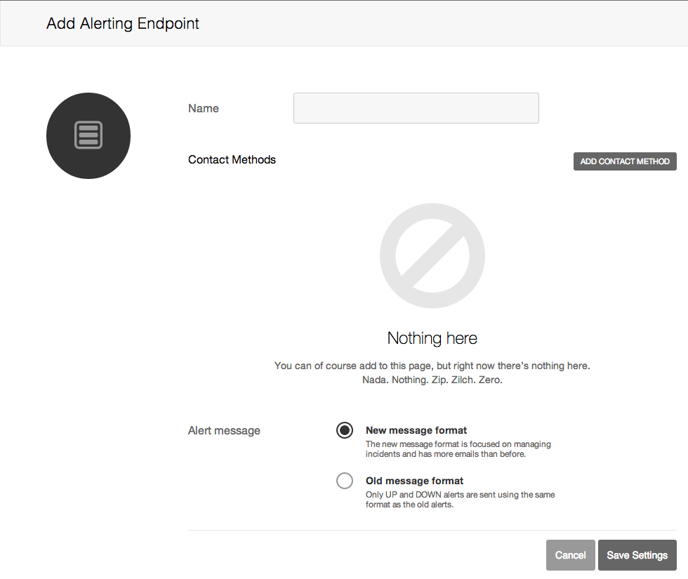
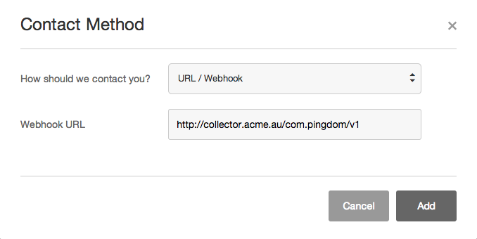
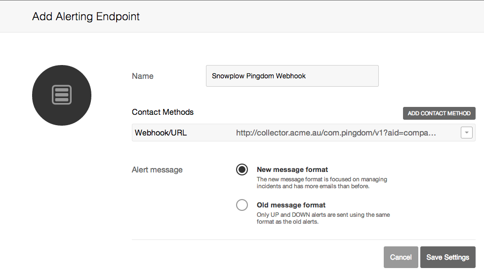
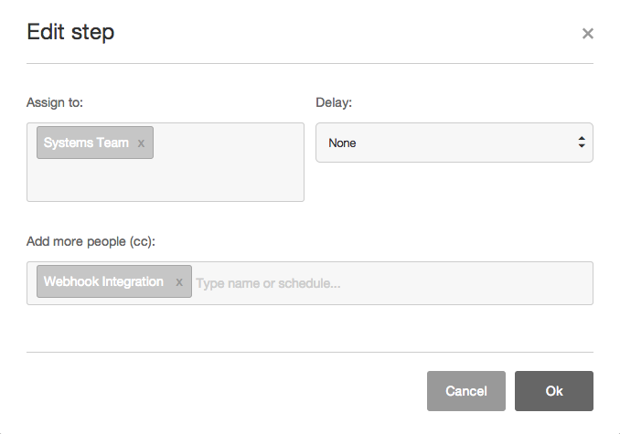

## Overview

This webhook integration lets you track a variety of events logged by [Pingdom](https://www.pingdom.com/).

Available events are:

- Incident assigned
- Incident notification of being closed

### Compatibility

- [Snowplow 0.9.14](https://github.com/snowplow/snowplow/releases/tag/0.9.14)\+ (`POST`\-capable collectors only)
- [Pingdom webhook API](https://support.pingdom.com/Knowledgebase/Article/View/94/0/users-and-alerting-end-points)

## Setup

Integrating Pingdom's webhooks into Snowplow is a two-stage process:

1. Configure Pingdom to send events to Snowplow
2. (Optional) Create the Pingdom events tables into Amazon Redshift

## Configure Pingdom

First login to your Pingdom account and click on the **Alerting** button which will be on the left hand side of the screen.

Now click on **Alerting Endpoints** in the submenu and then click the **Add Alerting Endpoint** button in the top right hand corner.

You should now see the following screen:



Fill in the name of your new **Alerting Endpoint**; for example: 'Snowplow Pingdom Webhook'.

Now click **Add Contact Method**:

- Select Url/Webhook for the **How should we contact you?** dropdown menu.
- Fill in your Collector URL in the **Webhook URL** field.

For the **Webhook URL** field you will need to provide the URI to your Snowplow Collector. We use a special path to tell Snowplow that these events are generated by Pingdom:

```markup
http://<collector host>/com.pingdom/v1?aid=<company code>
```

The `aid=` name-value pair in your URI's querystring is optional; this is the `app_id` parameter taken from the [Snowplow Tracker Protocol](/docs/migrated/collecting-data/collecting-from-own-applications/snowplow-tracker-protocol/). You can use it to specify which company in Pingdom these call complete events belong to. Putting it all together, our setup screen now looks like this:



If you want, you can also manually override the event's `platform` parameter like so:

```markup
http://<collector host>/com.pingdom/v1?aid=<company code>&p=<platform code>
```

Supported platform codes can again be found in the [Snowplow Tracker Protocol](/docs/migrated/collecting-data/collecting-from-own-applications/snowplow-tracker-protocol/); if not set, then the value for `platform` will default to `srv` for a server-side application.

After we have finished adding the contact method simply click **Save Settings**.



You will now need to add this endpoint to your **Alert Policies** for the webhook to be used.

Navigate to the **Alert Policies** page by clicking the **Alert Policies** button in the **Alerting** submenu.

- If you have not set up an **Alert Policy** before please consult this guide before continuing: [Setting up Pingdom Alerts](https://support.pingdom.com/Knowledgebase/Article/View/95/28/setting-up-alerts)

Now select the policy which you want the webhook to be activated from (click anywhere on the row with the policy), or create an entirely new policy for the webhook.

Select the small dropdown arrow at the end of the description of what is currently occuring for this policy and click **Edit**.


Now click in the **Add more people (cc)** field and type in the name that you gave to your webhook endpoint.



Save the changes you have made to the policy, anything being monitored that has this policy assigned will now trigger the webhook as well!

There are other configurations for how you can send information from Pingdom we suggest having a look at the [Pingdom webhook API](https://support.pingdom.com/Knowledgebase/Article/View/94/0/users-and-alerting-end-points) for more information on contact methods and settings if this method does not suit your needs.
