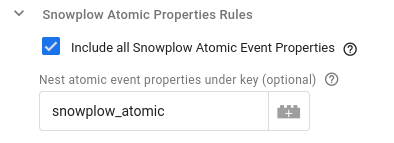
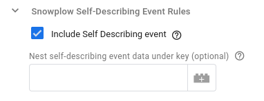

## Video Walkthrough

In the following short video a complete example configuration of the Snowplow GTM-SS HTTP Request Tag is presented.

Scenario: The example assumes that we want to send a POST HTTP Request to an example custom destination endpoint, where we would like the body of the request to have the following structure:

```
{
  "api-key": "myApiKey",
  "user_identifier": ...
  "event_data": {
    ...
  },
  "user_data": {
    ...
  }
}
```

where, for this example:

- Our endpoint expects the `api-key` inside the request body.
- As our `user_identifier` we want to map the value of the `client_id` from the client event.
- Inside `event_data` we want to include:
    - the common event data
    - the Self-Describing event data
    - the performance timing data from the Snowplow [Performance Timing Context](https://github.com/snowplow/iglu-central/blob/master/schemas/org.w3/PerformanceTiming/jsonschema/1-0-0)), with `performance_timing` as the property name
    - the page view id from the Snowplow [web\_page context](https://github.com/snowplow/iglu-central/blob/master/schemas/com.snowplowanalytics.snowplow/web_page/jsonschema/1-0-0), with `page_view_id` as the property name.
- Under `user_data` we want to map the `user_data` from the client event.

You can read on below for more details on each configuration option.

## Configuration options

### Destination URL (required)

Set this to the URL of your custom HTTP endpoint.

### Wrap the request body inside an array

By default, the JSON body is an object. For example:

```
{ "myProperty": "myValue" }
```

This option allows you to wrap the resulting object of the request body inside an array:

```
[{ "myProperty": "myValue" }]
```

### Include all event data in the request body

This option allows you to relay the full client event into the body of the request. Enabling this option, consequently disables both the Snowplow and the Additional Event Mapping Options, which allow to cherry-pick event properties and customize the request body.

## Snowplow Event Mapping Options

This section includes the mapping rules that concern a Snowplow event as claimed by the [Snowplow Client](/docs/migrated/forwarding-events-to-destinations/forwarding-events/google-tag-manager-server-side/snowplow-client-for-gtm-ss/):

### Snowplow Atomic Properties Rules

This option indicates if all Snowplow [atomic](https://github.com/snowplow/iglu-central/blob/master/schemas/com.snowplowanalytics.snowplow/atomic/jsonschema/1-0-0) properties of the event should be included in the JSON body. By default this option is disabled.

If enabled, an additional text field optionally allows you to specify a key under which those atomic properties will be nested. Leaving it blank adds those properties in the request body without nesting. Dot notation can also be used here.

As an example, this section configured as:



will result in the following JSON structure:

```
{
    ...,
    "snowplow_atomic": {
        "app_id": "fooBar",
        "platform": "mobile",
        ...
    },
    ...
}
```

Please, note that some of the Snowplow atomic properties are already mapped to [common event properties](https://developers.google.com/tag-platform/tag-manager/server-side/common-event-data) by the [Snowplow Client](/docs/migrated/forwarding-events-to-destinations/forwarding-events/google-tag-manager-server-side/snowplow-client-for-gtm-ss/).

### Snowplow Self-Describing Event Rules

This option indicates if the Snowplow Self-Describing data will be included in the request body and it is enabled by default.

Similarly to the above section, you can also specify a key under which the self-describing data will be nested. Leaving it blank adds those properties in the request body without nesting. Dot notation can also be used here.

As an example, this section configured as:



will result in the following JSON structure:

```
{
    ...,
    "self_describing_event_com_acme_test_foo_1": {
        "mySelfDescProp": "exampleValue",
        ...
    },
    ...
}
```

### Snowplow Event Context Rules

This section describes how the HTTP Request tag will use the context Entities attached to a Snowplow Event.

#### Extract entity from Array if single element

Snowplow Entities are always in Arrays, as multiple of the same entity can be attached to an event. This option will pick the single element from the array if the array only contains a single element.

#### Include all Entities in request body

Leaving this option enabled (default) ensures that all Entities on an event will be included within the request data.

Optionally, you can also specify a key under which the Snowplow event's contexts will be nested. Alternatively, leaving it blank adds all entities in the request body without nesting.

Disabling this option, reveals the options so that individual entities can be selected for inclusion. Using the "Snowplow Entity Mapping" table, these entities can also be remapped to have different names in the JSON body of the request. The entity can be specified in two different formats:

- Major version match: `x-sp-contexts_com_snowplowanalytics_snowplow_web_page_1` where `com_snowplowanalytics_snowplow` is the event vendor, `web_page` is the schema name and `1` is the Major version number. `x-sp-` can also be omitted from this if desired
- Full schema match: `iglu:com.snowplowanalytics.snowplow/webPage/jsonschema/1-0-0`

#### Include unmapped entities in request body

This option enables you to ensure that all unmapped entities (i.e. any entites not found in the "Snowplow Entity Mapping" rules above) will be included in the request body.

Again, optionally, you can also specify a key under which the Snowplow event's unmapped entities will be nested. Alternatively, leaving it blank adds the unmapped entities in the request body without nesting.

## Additional Event Mapping Options

If you wish to pick other properties from the Client event and map them into the request body, this can be specified in this section.

### Event Property Rules

#### Include common event properties

Enabled by default, this option sets whether to include the event properties from the [Common Event definition](https://developers.google.com/tag-platform/tag-manager/server-side/common-event-data) in the request body. Inclusion of the `user_data` property is not affected by this setting (see next option).

Also, you can optionally specify a key under which the Common Event properties will be nested. Alternatively, leaving it blank adds the the common event properties in the request body without nesting.

#### Include common user properties

Disabled by default, this option sets whether to include the `user_data` properties from the common event definition in the request body.

Again, you can optionally specify a key under which the `user_data` properties from the common event will be nested. Alternatively, leaving it blank adds the `user_data` in the request body without nesting.

#### Additional Event Property Mapping Rules

Using this table, you can additionally specify the Property Key from the Client Event, and then the key you could like to map it to (or leave the mapped key blank to keep the same name). You can use Key Path notation here (e.g. `x-sp-tp2.p` for a Snowplow events platform or `x-sp-contexts_com_snowplowanalytics_snowplow_web_page_1.0.id` for a Snowplow events page view id (note the array index 0) or pick non-Snowplow properties if using an alternative Client.

## Additional Request Data

This section allows you to add custom properties in the request body that are "external" to the event, in other words it provides the ability to add custom constant or variable request data.

## Request Headers

Similarly to the above, this section allows you to add custom headers to the HTTP request towards your custom endpoint.

## Additional Options

Finally, this section offers two additional configuration options:

- Changing the HTTP request method from POST (default) to PUT.
- Changing the default request timeout (5000 seconds)
