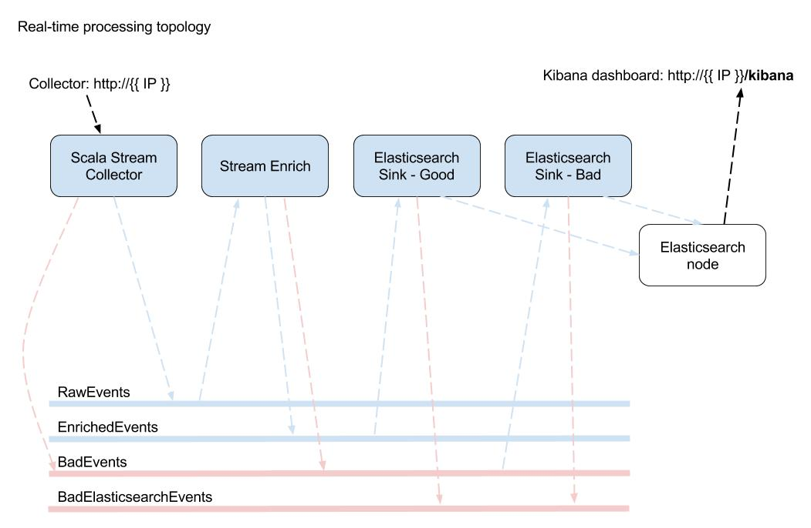

## Overview

Snowplow Mini is, in essence, the Snowplow real time stack inside of a single image. It is an easily-deployable, single instance version of Snowplow that serves three use cases:

1. Giving a Snowplow consumer (e.g. an analyst / data team / marketing team) a way to quickly understand what Snowplow "does" i.e. what you put it at one end and take out of the other
2. Giving developers new to Snowplow an easy way to start with Snowplow and understand how the different pieces fit together
3. Giving people running Snowplow a quick way to debug tracker updates (because they can)

All setup for Snowplow Mini is done within the AWS Console and will incur small amounts of running costs, depending on the size of the EC2 instance you select.

This service is available as an EC2 image within the AWS Community AMIs in the following regions:

- ap-northeast-1: ami-e129d29e
- ap-northeast-2: ami-2b812a45
- ap-south-1: ami-206c424f
- ap-southeast-1: ami-4029173c
- ap-southeast-2: ami-49d5072b
- ca-central-1: ami-7fef6c1b
- eu-central-1: ami-72e8dd99
- eu-west-1: ami-eae7dd93
- eu-west-2: ami-9412fef3
- sa-east-1: ami-a60e57ca
- us-east-1: ami-83b7defc
- us-east-2: ami-135e6176
- us-west-1: ami-54405a34
- us-west-2: ami-ab0a70d3

The software stack installed:

- Snowplow Stream Collector 0.11.0
- Snowplow Stream Enrich NSQ 0.16.1
- Snowplow Elasticsearch Sink 0.10.1
- Snowplow Iglu Server 0.2.0
- Elasticsearch 1.7.5
- Kibana 4.0.1
- Postgresql 9.5

Note: All services are configured to start automatically so everything should happily survive restarts/shutdowns.

To understand the flow of data please refer to the following diagram:

## Security Group

In the EC2 Console UI select `Security Groups` from the panel on the left.

Select the `Create Security Group` button and fill in the name, description and what VPC you want to attach it to.

You will then need to add the following InBound rules:

- Custom TCP Rule | Port Range (80)
- CIDR range `0.0.0.0/0`
- Custom TCP Rule | Port Range (443)
- CIDR range `0.0.0.0/0`
- SSH (optional):
    - Custom TCP Rule | Port Range (22)
    - CIDR range `{{ YOUR IP HERE }}/32`

For OutBound you can leave the default to allow everything out.

## Choose AMI

In the EC2 Console UI select the `Launch Instance` button then select the `Community AMIs` button. In the search bar enter `snowplow-mini-0.5.0` to find the needed AMI and then select it.

## Choose Instance Type

As we are going to be running several applications in unison we recommend to use a `t2.medium` or larger.

## Configure Instance

If you created your Security Group in a different VPC than the default you will need to select the same VPC in the Network field.

**NOTE**: If you select a custom VPC ensure that you select `Enable` for the Auto-assign Public IP option.

## Add Storage

Depending on how long you intend to run Snowplow Mini and how much data you intend to send/store you will need to change the size of the block store accordingly.

For basic testing and debugging 8Gb should suffice.

We also recommend changing the `Volume Type` to GP2 from Magnetic for a smoother experience.

## Tag Instance

Add any tags you like here.

## Configure Security Group

Select the Security Group you created in Step 2.

## Review

Press the `Launch` button and select an existing key-pair, or create a new one, if you want to be able to SSH onto the box.
