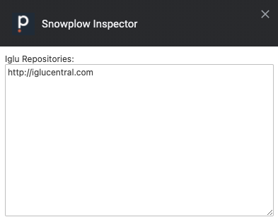
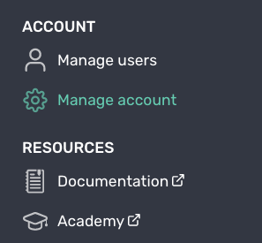
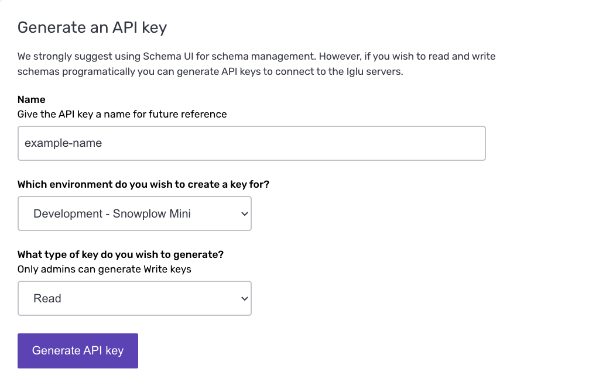
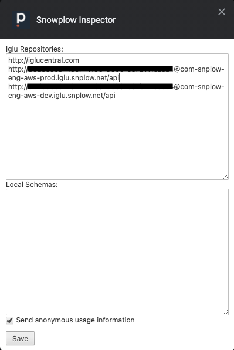

At Snowplow we frequently use the [Poplin chrome extension](https://chrome.google.com/webstore/detail/snowplow-inspector/maplkdomeamdlngconidoefjpogkmljm?hl=en) to check for event emission on a web page, we also recommend that our clients do the same when in the process of QA’ing their tracking code. This extension is an open source project by [Poplin data](https://poplindata.com/), one of our partners operating in Australia and New Zealand - the source code for the extension can be found [here](https://github.com/poplindata/chrome-snowplow-inspector).

Once added to chrome the extension can be opened by opening developer tools (ctrl-shift-I), where it has its own tab named ‘snowplow’ (look for the tab adjacent to ‘Elements’, ‘Console’, ‘Network’, etc. - it may be necessary to expand the list of tabs using the chevrons >>. 

**How it works**

As a user browses a webpage they can perform different actions that may be tracked as Snowplow events. These events are sent as HTTP requests to the Snowplow collector that the tracker on the webpage is pointed towards. Simply put, what the Poplin extension does is parse these same HTTP requests into a more easily readable format. This allows anyone with the extension to more easily see what actions on a webpage with Snowplow tracking trigger what events to be sent to a Snowplow pipeline. 

In the example below two events were fired as HTTP post requests from a test webpage: a **page\_view** event and a **link\_click** event. 

Within the parsed out HTTP requests that comprise the event payload are a variety of [Snowplow canonical event](/docs/migrated/understanding-your-pipeline/canonical-event/) fields such as unique event\_ids, timestamps and user and session identifiers, as well as any custom event or entity fields.

**The Role of The Poplin Extension in Event QA** 

The Poplin extension is an invaluable tool for anyone who is pushing tracking live as it gives real time, easy to access, information on what events are being emitted and what the contents of these events are. This makes the tool a good first port of call when trying to answer questions such as “why is X event not appearing in my data warehouse” by showing whether or not the event is actually firing on a chosen webpage.  

Additionally the extension can be configured to show whether or not an event has passed validation according to any event validation rules codified in jsonschema - stored in an iglu registry. 

By default the extension is able to see jsonschemas for events and entities that are built into the Snowplow javascript tracker, as they are publicly available on [iglucentral.com](http://iglucentral.com). 

However the extension can be configured to compare events against private schema repositories (that contain your organization's proprietary jsonschemas). If the extension is not configured to point towards your private schema repository then any custom events or entities will not be recognised by the extension. An example of an unrecognized event is shown below: 

Clicking on the “unrecognised” button and following the steps below will allow you to configure your own Poplin extension to also use jsonschemas from private repositories that you have access to. 

Upon clicking on the “unrecognised” button you will be directed to the extension options (shown below), which should contain the iglucentral.com URL by default:

Additional iglu repositories can be added. Each repository can be delimited by spaces, lines or commas and the format for repositories is either:

For the production jsonschema repository:

`http://{{API_auth_key}}@com-acme-prod.iglu.snplow.net/api`

For the development jsonschema repository:

`http://{{API_auth_key}}@com-acme-dev.iglu.snplow.net/api`

Unlike the iglucentral.com repository these private repositories cannot be accessed directly via the browser. 

The organisation specific API authentication key can be generated via the Snowplow BDP Console by navigating to the Iglu API key management page (steps shown below):

Step 1:

Step 2:

Step 3:

A note on the difference between the two jsonschema repositories: the production jsonschemas are bound to the production snowplow pipeline and are what validate events that land in the final clean data set in the data warehouse or datalake. 

The development jsonschemas are bound to a QA tool called [snowplow mini](https://github.com/snowplow/snowplow-mini) that can be used for the real time validation of events. This tool was created to enable jsonschemas to be QA’ed prior to pushing tracking live to production, events that are validated against these development jsonschemas do not land in a data warehouse. 

In the example below I have added two example repositories for the Snowplow AWS engineering development environment, one for a production jsonschema registry and one for a development jsonschema registry. 

Now that the extension can query your private iglu repositories the extension will be able to tell you in real time whether your events and entities are failing validation from entirely within the browser. An example of an event passing validation is shown below:

An example of an event failing validation is shown below, the reason for this event failing validation is due to “example\_field\_1” being a required field meaning it cannot be null.

This is useful, but when it comes to the debugging of failed events and the investigation of exactly WHY a particular event has failed validation there are additional tools that should be considered.

For events that failed validation against a schema in the dev registry Snowplow mini is a dedicated tool that has been built to provide real time, actionable feedback on why events are failing validation. For events that failed validation in production see our guides on [how to query failed events](/docs/migrated/managing-data-quality/failed-events/failed-events-in-athena-and-bigquery/) from their respective destinations. These failed events have a [specific format](/docs/migrated/managing-data-quality/failed-events/understanding-failed-events/) that includes an array of helpful, detailed error messages that explain the exact reasons why the event failed validation.
