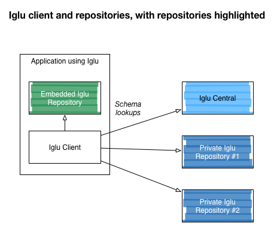

An Iglu repository acts as a store of data schemas (currently JSON Schemas only). Hosting JSON Schemas in an Iglu repository allows you to use those schemas in Iglu-capable systems such as Snowplow.

## Technical architecture

So far we support two types of Iglu repository:

1. **Remote repositories** - essentially websites containing schemas which an Iglu client can query over HTTP
2. **Embedded repositories** - which are embedded in a piece of software (typically alongside an Iglu client)

In this diagram we show an Iglu client resolving a schema from Iglu Central, one embedded repository and a further two remote HTTP repositories:

## Available Iglu repositories

We currently have two Iglu "repo" technologies available for deploying your Iglu repository - follow the links to find out more:

| **Repository** | **Category** | **Description** | **Status** |
| --- | --- | --- | --- |
| Iglu Server | Remote | An Iglu repository server structured as a RESTful API | Production-ready |
| Static repo | Remote | An Iglu repository server structured as a static website | Production-ready |
| JVM-embedded repo | Embedded | An Iglu repository embedded in a Java or Scala application | Production-ready |

## Iglu Central

[Iglu Central](http://iglucentral.com/) is a public repository of JSON Schemas hosted by [Snowplow Analytics](http://snowplowanalytics.com/). For more information on its technical architecture, see [Iglu Central](/docs/pipeline-components-and-applications/iglu/iglu-central-setup/index.md).
